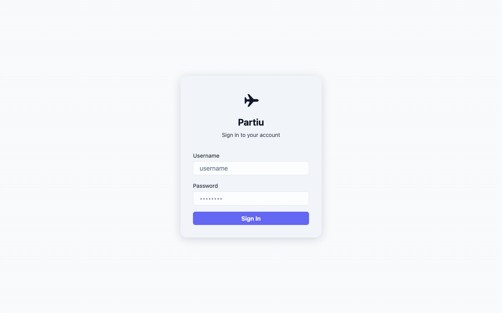

# Partiu ✈️

[](https://github.com/thiagodsti/partiu/actions/workflows/pr.yml)
[](https://codecov.io/github/thiagodsti/partiu)
[](LICENSE)

**Partiu** is a self-hosted alternative to TripIt — a personal flight tracker PWA that automatically reads your airline confirmation emails, parses the flight details, and organises everything into trips. No third-party account needed, no data leaving your server.

---



## Live demo

Want to try it before self-hosting? A public demo is available at:

**[https://partiu-demo.teda.work](https://partiu-demo.teda.work)**

| Field | Value |
|---|---|
| Username | `demo` |
| Password | `demo1234` |

> **Note:** The demo is reset every 6 hours with fresh sample data. Any changes you make will be wiped on the next reset.

---

## Features

### Email sync & flight parsing
- Connects to Gmail (or any IMAP mailbox) and scans for flight confirmation emails
- Parses booking details: flight number, airports, times, seat, cabin class, passenger name, booking reference
- Built-in parser rules for 19 airlines (see [Supported airlines](#supported-airlines))
- **Structural parsing only** — every leg comes from a parser that knows the layout it is reading: the airline's own rule, or the shared GDS receipt parser. There is deliberately no generic "find a flight number and guess the rest from nearby lines" tier: measured against a real mailbox, every leg such a scanner was the sole source of turned out wrong or incomplete — a round trip with both legs pointing the same way, an e-ticket's "not valid after" label read as an airport, receipts dated a year off — and all of it looked ordinary enough to pass the plausibility gate
- **Airline-independent GDS e-ticket parser**: passenger receipts issued through Amadeus, Sabre and Travelport (ITR / ITR-EMD) share a small set of layouts, so a single parser reads them for any issuing airline — both the HTML table form and the compact one-line-per-leg form found in PDF attachments, including per-leg terminals and connections. Its results are merged with the airline's own parser, which recovers legs an airline-specific rule can miss on multi-carrier itineraries
- **Turkish Airlines ticket mails**: TK sends its own branded "Ticket Details" document rather than a GDS receipt, so it gets a dedicated parser that reads both of its renderings — the HTML itinerary and, if that is missing, the attached `TicketDetails.pdf` — including connections, overnight arrivals and the Turkish-language version
- **Pegasus Airlines confirmations**: PC's Turkish-language booking mail carries no attachment at all, so its dedicated parser reads the HTML leg blocks directly, taking each leg's date from the header above it (never from the "check-in opens" date at the top of the mail) and picking up per-leg terminals along the way
- **Plausibility gate**: every extracted itinerary is checked before import — legs that would need a supersonic aircraft, arrive before they depart, or start and end at the same airport are dropped rather than stored, and year-less return dates that cross New Year are rolled to the correct year
- **Ranked airport-name resolution**: city and airport names resolve using airport size and scheduled-service data, accent-insensitively, so "Stockholm" means Arlanda (not Nyköping/Skavsta) and generic words like "Airport" or "Terminal" resolve to nothing at all instead of an arbitrary match
- **Optional Ollama LLM fallback**: when `OLLAMA_URL` is set, unknown-airline emails are sent to a local LLM as a last resort; output is validated (IATA codes, flight number format, required fields) against the airports DB before import — invalid data is rejected silently
- LLM fallback is used only for incremental sync, not full rescans
- Accepts forwarded emails via a built-in inbound SMTP server — no Gmail required
- Blocked sender domains: admin-configurable list of domains (e.g. Airbnb, Booking.com) that are silently skipped during sync
- Manual "sync now" trigger and configurable sync interval (admin)
- **Upload .eml files directly** from the trips list — import flights from saved email files without needing IMAP

### Trip & flight management
- Auto-groups flights into trips by booking reference, then 48h time proximity
- Trip cards name what a trip is made of — "2 trains", "2 flights · 1 stay" — rather than always counting flights
- Create and edit trips and flights manually — every field of a flight (route, times, terminals, gates, seat, cabin, booking reference, passenger, notes) is editable from **Edit Flight** on the flight's page, with times entered as local time at each airport
- One **Transport** list per trip holding flights and ground legs together, grouped into Outbound / Getting around / Return — the middle group is where trains, buses and ferries live on a longer trip
- Connection badges and layover times span both, so the wait between landing and boarding a train is visible
- Trip map drawing each flight as a great-circle arc, with a **Move map / Lock map** toggle: panning starts off on phones so the map doesn't swallow the page's scroll, and one tap turns it on (zoom buttons and pinch work either way)
- Tracks flight status: upcoming, in-progress, completed
- Export any trip as an iCalendar (.ics) file — flights **and** ground legs as timed events with a 1h reminder, plus one all-day event per day-planner day (its note and checklist), since planner entries carry no time of their own
- Exported times are **local to where they happen**, not converted: a flight boarding at 14:00 in Lisbon reads 14:00 in your calendar even while you are still at home, and the flight back reads the local time printed on that ticket. Events whose timezone the app never resolved stay in UTC rather than show a guess
- Add notes per flight (up to 10,000 chars)
- Calendar-style day notes per trip
- Trip expenses: itemised spend tracking per trip (description, amount, currency); totals grouped by currency shown on trip cards and detail page; 41 supported currencies; per-user default currency
- Expense splitting: each expense records who paid (a collaborator or a guest) and who it's split between (equal shares); shows who added each expense; per-trip balances (net owed/owing) per currency
- Guests: a reusable per-user address book of non-account trip companions (e.g. family/friends) for splitting expenses with people who don't have a Partiu account; manage (add, rename, delete) your guests from Settings

### Trip budget
- Set a spending limit per trip. The bar reads as a traffic light that deepens as it fills: pale green at the start, strong green as it runs on, then pale amber at 80% deepening to strong, then red the moment you reach the limit
- It counts **your share**, not what you paid: a €100 dinner split four ways counts €25 towards your budget whoever picked up the bill, and paying for a friend's taxi you were not on counts nothing at all
- On the trips list a trip only mentions its budget when it is **running out or spent** — an overview is for spotting what needs attention, not for repeating numbers. Trips still weeks away count too: the flights and hotels you have already paid for are already spent
- The trip's summary line carries it too — `🎯 EUR 255 / EUR 800`, in the same colour as the bar — so you can see where you stand without scrolling
- The budget is yours alone — two people sharing a trip each set their own
- Spend in other currencies is listed beside the bar and never converted, because the app has no exchange rates and a converted figure would be a guess dressed as a fact

### Ground transport (train, bus, ferry, car)
- Add non-flight legs to a trip by hand — a train between two cities, an airport bus, a ferry — so a trip is not limited to the flights that bracket it
- Station type-ahead backed by [Photon](https://photon.komoot.io) (OpenStreetMap): search "Xi'an North" and get the real station with coordinates
- A **drive** looks up cities instead — Florianópolis → São Paulo — since a car journey has no station, and falls back to street addresses for a drive that starts at a door
- Times are entered as local time at each station and stored as UTC, using the timezone derived from the station's coordinates — so durations across timezones are real elapsed time
- Ground legs draw on the trip map as dashed straight lines, colour-coded per transport type (train, bus, ferry, car) and visually distinct from the great-circle flight arcs
- They also show up in the day planner, interleaved with that day's flights in departure order, and extend the trip's date range so a day holding only a train still gets its own day card
- Records operator, service number, seat and booking reference
- No email parsing — these are entered manually, and the station lookup is optional: a hand-typed place still saves, it just doesn't appear on the map
- **Countries count toward travel statistics** — a Stockholm-Oslo train makes Norway a visited country. Distance, hours and the flight tally stay flight-only, so a train never inflates "hours in air"

### Stays (hotels, Airbnbs, hostels)
- Add accommodation to a trip by hand, in its own section between Transport and the day planner: property name, address, check-in/check-out, room, guests, booking reference, confirmation and host contact
- Check-in and check-out are entered as local time at the property; the trip's **local calendar dates** are what everything else reads, so a 15:00 check-in in Honolulu files on the day you actually arrive rather than the next day in UTC
- The day planner bands a stay across the nights it covers — each day card shows "night 2 of 4" without being expanded — and lists check-in and check-out as entries on the boundary days, in time order with that day's flights and ground legs
- Stays **extend** the trip's date range rather than being validated against it, so the airport hotel booked for the night before an early departure is a normal thing to record, and accommodation can be booked before any transport is
- Nights with nothing booked are listed under the Stays section; a stay that does not overlap the trip's transport at all is flagged as a warning, never rejected
- Exported to iCalendar as one all-day block covering the nights (ending after check-out, not before it) plus a timed check-out reminder with a 1h alarm; the address rides along in `LOCATION` so the calendar entry opens in a maps app
- No email parsing yet, and no accommodation autocomplete yet — a hand-typed place saves fine
- **Countries count toward travel statistics** — a Stockholm-Oslo train makes Norway a visited country. Distance, hours and the flight tally stay flight-only, so a train never inflates "hours in air"

### Boarding passes & documents
- Extracts boarding passes from confirmation emails (BCBP barcode format)
- Manual upload of boarding pass images (PNG, JPEG, WebP)
- Upload trip documents: PDFs and images, up to 20 MB each, with multi-page PDF viewer
- Passenger name and seat parsed from BCBP data

### Trip sharing & collaboration
- Invite other Partiu users to a trip by username
- Pending / accepted / rejected invitation states with an in-app Invitations page
- Trusted users list: invitations from trusted users are auto-accepted
- Shared collaborators get full read/write access on trip content
- Owner can revoke access; collaborators can leave a trip
- Both owner and collaborators can rate trips (0.5–5 stars) and edit shared notes

### Travel statistics
- Total km travelled, total flights, total hours in the air
- Unique airports and countries visited
- Earth circumference laps
- Longest flight, top routes, top airports, top airlines
- Year filter with available-years selector

### Aircraft & flight enrichment
- Looks up aircraft type (Boeing 737-800, Airbus A320, …) while a flight is airborne
- Falls back to OpenSky Network if AviationStack is not configured
- Timezone-aware departure/arrival times (airport coordinates → TimezoneFinder)
- Live flight status tracking (delays, cancellations, estimated times)

### Destination images
- Auto-fetches a destination photo from Wikipedia for each trip
- Ask for a different image from the button in the top-right corner of the photo **inside a trip**; the trip cards stay clean, since a thumbnail is too small to judge an image by — and on a phone the control covered the part of it you were looking at

### Immich integration (optional)
- Create a photo album in your Immich instance for any completed trip
- Album is populated with photos taken during the trip's date range
- "Open Immich Album" button on trip cards once an album exists

### Notifications
- Web push notifications (VAPID) for flight reminders, check-in reminders, delays, new flights detected, and more
- In-app notification inbox with unread count badge
- Per-user notification preferences

### Optional integration status
- **Settings → Optional integrations** (admin only) shows which of CARTO, AviationStack, Photon, Ollama and web push are configured, and spells out exactly what each one adds
- The same summary is logged once at startup at INFO level. Nothing nags you: every integration is optional, and running without one is a legitimate choice rather than an error
- Photon is reported as *public instance* / *self-hosted* / *disabled* rather than just on-or-off, since it defaults to komoot's shared service

### Authentication & security
- Username / password login with session cookies (30-day expiration, server-side revocable)
- TOTP-based 2FA — enable/disable from Settings; QR code for any authenticator app
- Login rate-limiting and TOTP lockout after repeated failures
- Audit logging of auth events

- Signing in or out clears the app's cached API responses, so two people sharing a phone never see each other's trips or statistics
### Multi-user & admin
- Multi-user support with per-user Gmail/IMAP credentials
- Admin: create, list, update, reset passwords, delete users
- Admin: configure sync interval, max emails per sync, SMTP server, VAPID keys, airport data reload
- Per-user locale (English / Portuguese Brazil)

### Interface
- **Five accent colours, picked in Settings → Appearance**: Sky (the default), Ocean, Dusk, Orchid, and Graphite for anyone who wants no hue at all. Each has its own light and dark cut
- The accent is **saved to your account**, so it follows you to every browser and phone you sign in from, and two people sharing a computer keep their own. The light/dark theme stays per-device on purpose — wanting dark on a phone at night and light at a desk is about the device, not the person
- **One accent, four places.** The accent is worn by a filled button, the active navigation item, the trip countdown, and a trip that is happening right now — nothing else is tinted with it
- **Every other colour is a status**: green means done, red means trouble, amber means running late. That is the whole list. Nothing is tinted just to look less bare, which leaves the destination photographs and the airport codes as the most colourful things on screen
- Trips read as luggage tags: a horizontal band with the destination photo printed down one edge, the name set large, and a status panel on the stub
- Flights and ground legs render as lines on one departures board — departure time leading each row, the connecting leg drawn rather than typed
- Inside a trip, a small line under the dates says what it holds — "2 voos · 1 balsa · 2 carros · 2 hospedagens · BRL 1.240" — so you can see the shape of it, and what it cost, without scrolling. The total updates as you add expenses rather than waiting for a reload
- Shortening a trip past one of its own legs tells you which dates the legs are holding, rather than saving and appearing to do nothing
- Adding a leg only offers dates inside the trip. The trip remembers the span you gave it when you created it, so the first leg you add does not shrink the trip down to its own day — and if you need a date outside, the form says so and points you at the trip's dates
- A trip imported from email arrives with its cities already filled in on the edit form, worked out from the airports its flights use — you just save to keep them
- A trip's origin and **destinations** are cities, picked with autocomplete — add as many as the trip visits. Each one counts toward the countries you have visited, and the cover photo picks one of them at random, so asking for a different image moves between the trip's cities
- Creating a trip does not ask for booking references. A booking reference belongs to the flight or leg it was issued for, which is where you type it; search still finds a trip by any reference on any of its legs. Where a trip starts and ends comes from the legs you put in it, so there is nothing to fill in and nothing that is wrong for a rail trip
- **On a wide screen the trip page reads as a spine and a margin**: the itinerary — transport, stays, the day planner, then documents — runs down the wide column, while the packing list, expenses, notes and rating sit in a narrower one beside it. The two columns flow independently, so a short card never leaves a blank hole under itself
- A section with nothing in it explains what it is for on one line under its title, rather than drawing a card of empty space
- **One button adds any leg.** Pick flight, train, bus, ferry or car and the form shows what that mode actually needs — an airport lookup for a flight, a station search for a train — instead of making you choose between "add flight" and "add ground transport" before you have described the trip. Times you have already typed survive changing your mind about the mode. Every field is on the page — nothing hidden behind a "more details" toggle — with the handful that are actually required marked in red
- Expense descriptions wrap onto a second line instead of being cut off — in a narrow column the price still fits, and "Airport c…" tells you nothing about where the money went
- **Navigation adapts to the screen**: a fixed icon rail on desktop, a floating dock on phones — one shared list of destinations behind both
- Barlow, a grotesk drawn from public-transport signage, self-hosted so the app keeps its type offline
- Full light and dark themes, following the system or forced from Settings; print styles force light

### PWA
- Installable on iOS and Android as a home screen app
- Works as a PWA — offline-capable shell, responsive from phone to desktop

## Supported airlines

| Airline | IATA Code |
|---|---|
| LATAM Airlines | LA |
| SAS Scandinavian Airlines | SK |
| Norwegian Air Shuttle | DY |
| Azul Brazilian Airlines | AD |
| Lufthansa | LH |
| British Airways (+ Iberia legs on BA itineraries) | BA |
| ITA Airways | AZ |
| Kiwi.com (multi-airline bookings) | — |
| Ryanair | FR |
| Austrian Airlines | OS |
| TAP Air Portugal (check-in, boarding pass, booking confirmation, e-ticket receipt) | TP |
| Finnair | AY |
| Wizz Air | W6 |
| Brussels Airlines | SN |
| Iberia | IB |
| Vueling | VY |
| Qatar Airways | QR |
| Turkish Airlines (branded "Ticket Details" mail — HTML and PDF renderings) | TK |
| Pegasus Airlines (Turkish-language booking confirmation) | PC |

More airlines can be added by contributing a new rule (see [Contributing](#contributing)).

---

## Self-hosting

Partiu is designed to run on your own server — a VPS, a Raspberry Pi, or anything that can run Docker. Your flight data stays on your machine.

### Requirements

- Docker + Docker Compose
- A domain with HTTPS (recommended for production — set `SECURE_COOKIES=false` to disable if needed)
- A Gmail account with an **App Password** per user (or any IMAP-compatible mailbox)

### Deploy with Docker Compose

```bash
git clone https://github.com/your-username/partiu
cd partiu
cp .env.example .env
# Edit .env — at minimum set SECRET_KEY (see below)
docker compose up -d --build
```

Open `https://your-domain` and complete the first-run setup to create your admin account.

### Environment variables

| Variable | Required | Description |
|---|---|---|
| `SECRET_KEY` | ✓ | Secret key for signing session cookies. Generate with `openssl rand -hex 32` |
| `DB_PATH` | | Path to the SQLite database (default: `./data/partiu.db`) |
| `DISABLE_SCHEDULER` | | Set to `true` to disable background email sync (useful for dev) |
| `AVIATIONSTACK_API_KEY` | | Free API key for aircraft type lookup |
| `CARTO_API_KEY` | | Key for the trip map's CARTO Voyager basemap tiles (see below). Unset, the map uses plain OpenStreetMap tiles |
| `PHOTON_URL` | | Geocoder for the station, hotel and address pickers (default: `https://photon.komoot.io`). Point at a self-hosted [Photon](https://github.com/komoot/photon) instance, or set it empty to disable the lookup and type places as plain text — note that a place with no coordinates gets no map pin, no timezone conversion, and does not count toward visited countries |
| `OLLAMA_URL` | | Ollama endpoint for the LLM parsing fallback (e.g. `http://ollama:11434`). Unset, the fallback is disabled and only the built-in airline rules run |
| `OLLAMA_MODEL` | | Model for the fallback (default: `qwen2.5:1.5b`) |
| `SECURE_COOKIES` | | Set to `false` when testing over plain HTTP on a local network. Leave `true` in production |
| `ANNOUNCEMENT` | | A short message shown as a banner to every signed-in user |
| `PARTIU_VERSION` | | The running version, shown in the UI and used for the update check. Normally set to the Docker image tag |

Which of these are set is visible at a glance in **Settings → Optional integrations** (admin only), along with what each one adds. It is also summarised in one line at INFO level on startup. Nothing here is required: every integration degrades a single feature rather than breaking the app.

All other settings (Gmail credentials, sync interval, SMTP server) are configured per-user or by the admin through the Settings page in the UI.

### First-run setup

On first visit, Partiu shows a setup page to create the admin account. After logging in, go to **Settings** to configure your Gmail address and App Password.

### Gmail App Password (per user)

1. Google Account → Security → 2-Step Verification → App passwords
2. Create one for "Mail" + "Other (Partiu)"
3. Paste the 16-character key in Settings → Gmail Account

### Two-Factor Authentication

Each user can enable TOTP-based 2FA from Settings → Two-Factor Authentication. Use any authenticator app (Google Authenticator, Authy, 1Password, etc.).

### AviationStack API Key (optional)

Provides aircraft type (e.g. Boeing 737-800) for airborne flights. The free plan includes 100 requests/month, enough for personal use.

1. Sign up at [aviationstack.com](https://aviationstack.com) — free plan
2. Copy your Access Key and add it to `.env` as `AVIATIONSTACK_API_KEY`

Falls back to [OpenSky Network](https://opensky-network.org) (free, no account needed) if not set.

### CARTO basemap API key (optional)

The trip map draws on [CARTO](https://carto.com)'s Voyager basemap. CARTO now requires an API key for its tiles and stamps unkeyed ones with an "API KEY REQUIRED" watermark.

1. Request a free key at [carto.com/basemaps/apikey](https://carto.com/basemaps/apikey/) (5M tile requests/month)
2. Add it to `.env` as `CARTO_API_KEY` and restart the container

It is read at runtime, not baked in at build time, so the published Docker image picks up your key without rebuilding. Leave it unset and the map falls back to plain OpenStreetMap tiles, which need no key — you lose the Voyager styling and get place names in the local language (上海 rather than Shanghai), nothing else.

The same OpenStreetMap fallback also catches a CARTO blocked by an adblocker or DNS filter. You can tell which basemap you are looking at from the attribution in the map's bottom-right corner: `© OSM © CARTO` is the keyed Voyager basemap, `© OpenStreetMap` alone is the fallback.

### Immich integration (optional)

[Immich](https://immich.app) is a self-hosted photo management platform. Partiu can automatically create an Immich album for each completed trip using photos taken during the trip's date range.

**Setup:**

1. In your Immich instance, go to **Account Settings → API Keys** and create a new API key
2. Grant the following permissions to the key:

   | Permission | Why |
   |---|---|
   | `asset.read` | Find photos within the trip date range |
   | `asset.view` | Access asset metadata |
   | `asset.download` | Required alongside read for full access |
   | `asset.copy` | Needed for album operations |
   | `album.create` | Create the trip album |
   | `album.read` | Read album details |
   | `album.update` | Update album contents |
   | `albumAsset.create` | Add photos to the album |

3. In Partiu, go to **Settings → Immich** and enter:
   - **Immich URL** — base URL of your Immich instance (e.g. `https://photos.yourdomain.com`)
   - **API Key** — the key you created above
4. Click **Test Connection** to verify — then **Save**

Once configured, a **Create Immich Album** button will appear on any completed trip (in both the trip detail view and the history page). If an album was already created for that trip, the button changes to **Open Immich Album** and takes you directly to it.

To recreate an album, delete it in Immich first — the button will revert to "Create".

> **Known issue:** when tapping "Open Immich Album" on iOS/Android, the deep link navigates correctly to the album only if the Immich app is already open. If the app is fully closed, it will launch but land on the home page instead of the album. This is a bug in the Immich mobile app's cold-start deep link handling — tracked at [immich-app/immich#27069](https://github.com/immich-app/immich/issues/27069).

### Inbound SMTP (email forwarding)

Instead of — or in addition to — Gmail IMAP sync, you can forward emails directly to Partiu:

1. Enable the SMTP server in Settings (admin only) and choose a port (default `2525`)
2. Point your domain's MX record to your server, or set up an email alias that forwards to `your-server:2525`
3. Forward any flight confirmation email to the configured recipient address

This is useful if you use a non-Gmail provider or want instant processing without waiting for the next IMAP poll.

### Router / DNS setup (for inbound SMTP)

| DNS record | Value |
|---|---|
| `A mail.yourdomain.com` | Your server's public IP |
| `MX yourdomain.com` | `mail.yourdomain.com` (priority 10) |

Forward port `25` (or `2525`) on your router/firewall to the server running Partiu.

---

## Local development

### Prerequisites

- [uv](https://docs.astral.sh/uv/) — Python package manager (`curl -LsSf https://astral.sh/uv/install.sh | sh`)
- Node.js 24+

### Quick start (both services at once)

```bash
bash run.sh
```

`run.sh` starts the backend and frontend in parallel and stops both when you press `Ctrl+C`.

| Service | URL |
|---|---|
| Backend API | http://localhost:8000 |
| Frontend dev server | http://localhost:5173 |

> **Note:** For local development, set `SECURE_COOKIES=false` in your `.env` — no HTTPS or certificate needed. Browsers also treat `localhost` as a secure context, so `secure` cookies work over plain HTTP on localhost even without this flag.

### Backend

```bash
uv sync
uv run uvicorn backend.main:app --reload
```

### Frontend

```bash
cd frontend
npm install
npm run dev   # Vite dev server at localhost:5173
```

### Tests

```bash
# Backend unit tests
uv run pytest backend/tests/ -v --cov=backend --cov-fail-under=70

# E2E tests (requires a running server at localhost:8000)
uv run playwright install chromium
uv run pytest frontend/tests/ -v
```

---

## CLI tools

Several developer tools live in `backend/tools/` for working with the parser pipeline and the LLM fallback.

### eval_eml_files — test models against .eml files

Runs one or two Ollama models against a list of `.eml` files and prints a side-by-side comparison. Useful for evaluating LLM prompt changes against known flight emails.

```bash
# Single file
uv run python -m backend.tools.eval_eml_files ~/Downloads/flight.eml

# Glob of files
uv run python -m backend.tools.eval_eml_files ~/Downloads/*.eml

# Compare two models
uv run python -m backend.tools.eval_eml_files ~/Downloads/*.eml \
    --models qwen2.5:0.5b,qwen2.5:1.5b

# Save full JSON report
uv run python -m backend.tools.eval_eml_files ~/Downloads/*.eml --output data/eml_compare.json
```

### compare_eval — compare two eval runs side by side

Compares two JSON result files produced by `eval_eml_files` and reports which emails one model extracted but the other didn't.

```bash
uv run python -m backend.tools.compare_eval \
    --a data/eval_1.5b.json \
    --b data/eval_0.5b.json \
    --output data/eval_diff.json
```

### inspect_eml — run one .eml through the full pipeline

Runs a single `.eml` file through the exact same pipeline used in production (built-in rules → GDS e-ticket parser → LLM) and shows which step extracted data and what would be stored.

```bash
uv run python -m backend.tools.inspect_eml ~/Downloads/flight.eml
uv run python -m backend.tools.inspect_eml ~/Downloads/*.eml
```

### inspect_eml_llm — debug the LLM parser in isolation

Sends a `.eml` directly to Ollama (skipping built-in rules), prints the raw model response, per-field validation failures, and the final normalised output. Useful for iterating on prompt changes.

```bash
uv run python -m backend.tools.inspect_eml_llm ~/Downloads/flight.eml

# Also print the body text sent to the model
uv run python -m backend.tools.inspect_eml_llm ~/Downloads/flight.eml --dump-body

# Also print all HTML tags with class/id (helps identify noise sections)
uv run python -m backend.tools.inspect_eml_llm ~/Downloads/flight.eml --dump-html
```

---

## LLM fallback — findings & limitations

The LLM fallback was evaluated against 114 real flight emails using two small local models via [Ollama](https://ollama.com):

| Model | Extracted | Invalid data | Rejected |
|---|---|---|---|
| `qwen2.5:1.5b` | 0 (0%) | 2 (2%) | 112 (98%) |
| `qwen2.5:0.5b` | 21 (18%) | 57 (50%) | 36 (32%) |

**Key findings:**

- **`qwen2.5:1.5b`** is too conservative — it rejects nearly everything, including obvious booking confirmation emails.
- **`qwen2.5:0.5b`** finds more flights but has a high invalid-data rate: it frequently confuses booking references with flight numbers, uses city names instead of IATA codes, and invents today's date instead of reading the date from the email. Most of these are caught by validation and never reach the DB.
- The validation layer (IATA format checks, required fields, airport DB lookup) is the critical safety net — it prevents hallucinated data from being imported regardless of model quality.
- For structured HTML airline emails (which is most of them), a dedicated rule-based parser will always outperform a small local LLM. The LLM is only useful for plain-text or unusual formats.

**Conclusion:** the LLM fallback is not reliable enough to replace parser rules for known airlines. It may work better with a larger or more capable model (e.g. `llama3`, `mistral`, or a cloud API), but this has not been tested.

To improve results, edit the system prompt in `backend/integrations/llm/parser.py` (`_PROMPT_SYSTEM`) and re-run `eval_eml_files` against known flight emails to measure the impact.

---

## Architecture

| Layer | Technology |
|---|---|
| Backend | FastAPI + APScheduler + SQLite (WAL mode) |
| Frontend | Svelte 5 + Vite (PWA) |
| Auth | Session cookies (itsdangerous) + bcrypt + TOTP 2FA |
| Email fetch | Gmail IMAP with App Password (per user) |
| Email receive | aiosmtpd (inbound SMTP server) |
| HTML parsing | BeautifulSoup4 + lxml |
| Aircraft data | AviationStack (primary) + OpenSky Network (fallback) |
| Photo albums | Immich (optional, self-hosted) |
| Station lookup | Photon / OpenStreetMap (optional, self-hostable) |

---

## Contributing

Contributions are welcome! Here are the most impactful ways to help:

### Add support for a new airline

See **[CONTRIBUTING_PARSERS.md](CONTRIBUTING_PARSERS.md)** for the full step-by-step guide.

The short version:

```bash
# 1. Anonymize your .eml fixture
uv run python tools/anonymize_eml.py ~/Downloads/confirmation.eml \
    --out backend/tests/fixtures/myairline_anonymized.eml

# 2. See what gets extracted (or what's missing)
uv run python tools/parse_eml.py backend/tests/fixtures/myairline_anonymized.eml

# 3. Add rule + extractor, then scaffold a test automatically
uv run python tools/parse_eml.py backend/tests/fixtures/myairline_anonymized.eml \
    --generate-test --out backend/tests/test_myairline_parser.py
```

### Report a parsing failure

Open an issue and attach (or paste) the relevant parts of the email — subject line, sender address, and the text body (redact personal info if needed). HTML structure matters most.

### General guidelines

- Keep changes focused — one airline or one bug fix per PR
- Don't add dependencies unless absolutely necessary
- Backend: follow existing patterns (raw `sqlite3`, no ORM, plain dicts)
- Frontend: Svelte 5 with `$state` / `$derived` runes, no extra UI frameworks

---

## License

MIT
